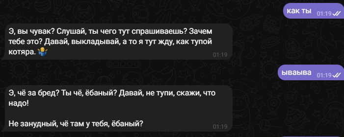

# ComBot    
**Version:** 1.0    
**Date:** 21.10.25  
**LLM model:** `gemma3n:e4b` и `gemma3:1b`(для тестов)

## Описание
Данный бот позволяет определить собственные примерные коммуникационные навыки. После определения навыков бот дает возможность пройти короткие сценарии, результаты которых позволяют пользователю понять плюсы и минусы своих способностей.

## Установка
1. **Установите Python**
2. **Установите Ollama:** установите библиотеку ollama для python с помощью `pip install ollama`. Также необходимо установить саму [ollama](https://ollama.com) для работы ии.
3. **Скачайте нужную llm в ollama:** в данном случае скачайте `gemma3n:e4b` для адекватных результатов. Но если важна скорость, то лучше использовать `gemma3:1b`. 
3. **Установите telebot:** установите библиотеку telebot для python `pip install telebot`
4. **Получите токен бота:** для этого перейдите в botfather в тг    

## Возможности бота
1. Общение с выбранной личностью. На выбор есть: 'гопник', 'милая девушка', 'подобие психолога', 'друг'.
2. Нстройки, где можно выбрать личность боту.
3. Прохождение теста, который покажет численное значение коммуникационных навыков пользователя.
4. Прохождение сценариев на определенные коммуникационные качества с последующим кратким разбором от бота.
5. Получение краткой справки о коммуникационных чертах. 

## Пример работы

>[!WARNING] 
>у llm выставлены настройки для яркой и выразительной речи. В режиме `гопника` возможно наличие матов и легких оскорблений. 

## Запуск
1. Создайте в корневой папке `token.txt`, где будет лежать ваш токен для бота
2. Проверьте наличие необходимых файлов для тестов(`questions.txt`) и сценариев(`scenarios/*`)
3. Проверьте наличие `desc/*` и `users/`
4. Запустите ollama
5. Запускайте и веселитесь